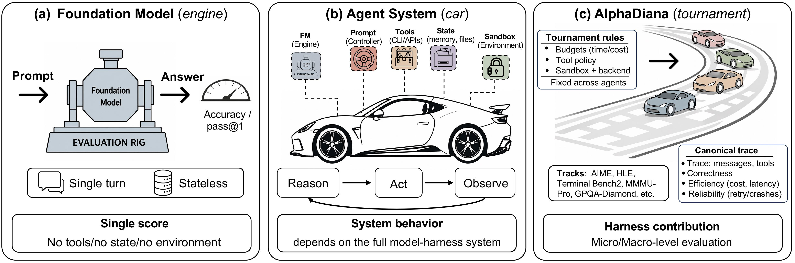

# AlphaDiana: A System for Evaluating Agentic Reasoning

**AlphaDiana** is an open-source framework for **system-level evaluation of LLM-based reasoning agents**. It enables standardized, reproducible benchmarking of agentic systems—such as **[OpenClaw](https://github.com/openclaw/openclaw)**—on frontier reasoning tasks, with support for sandboxed code execution, multi-turn tool use, and full trajectory logging.

<p align="center">
  
</p>
<p align="center">
  <em><strong>Figure 1.</strong> Why agentic reasoning requires system-level evaluation: foundation models are evaluated like engines, agents behave like cars shaped by tools and state, and AlphaDiana serves as the tournament organizer that standardizes evaluation and records canonical traces.</em>
</p>

## Why AlphaDiana?

Reasoning performance in agent systems depends on more than the base model alone. It is also shaped by the **agent framework, tool interface, execution environment, and evaluation protocol**.

AlphaDiana is designed for **fair, reproducible, and transparent** evaluation of agentic reasoning systems.

With AlphaDiana, you can:
- evaluate **OpenClaw-style reasoning agents**
- compare against a **direct LLM baseline**
- run evaluations with **sandboxed execution**
- benchmark on **AIME, GPQA, HLE, MMMU-Pro, software tasks, and custom datasets**
- record and inspect **full execution traces**
- launch and compare runs through both **CLI and dashboard**

Typical questions AlphaDiana helps answer:
- How much does an agent improve over the base model?
- How well does it perform on a target benchmark?
- How much do tools and sandbox settings affect results?
- What failure modes appear in execution traces?

## Key Features

- **Standardized evaluation** for reproducible benchmarking of agentic reasoning systems  
- **OpenClaw support** for multi-turn reasoning with tool use and code execution  
- **ROCK sandbox integration** for safe, isolated execution  
- **Direct LLM baseline** for clean agent-vs-model comparison  
- **Built-in benchmarks** including AIME, GPQA, HLE, MMMU-Pro, and custom tasks
- **Full trace logging** for debugging, inspection, and analysis  
- **Web dashboard** for launching, monitoring, and comparing runs  
- **Automatic sandbox management** with configurable concurrency

## Quick Start

### Prerequisites

- Linux
- Python >= 3.10, Conda
- Docker (the current user should be in the `docker` group)
- An API key for a model provider (e.g., [OpenRouter](https://openrouter.ai/))

### 1. Install

```bash
git clone https://github.com/tmlr-group/AlphaDiana
cd AlphaDiana

# One-click setup: creates a checkout-local conda env, installs all
# dependencies, starts services
export OPENCLAW_GATEWAY_TOKEN="$(openssl rand -hex 32)"
bash scripts/quickstart.sh

# Note: If quickstart fails, or you want to reset the ports/RAY clusters, please run: bash scripts/cleanup_rock_ports.sh (USE WITH CAUTION!)

# Pull the reasoning image (OpenClaw pre-installed)
docker pull tmlrgroup/alphadiana:v1
```

> **Note:** You can also build it locally:
>
> ```bash
> docker build -t openclaw-reasoning:v1 -f alphadiana/harness/openclaw/deploy/Dockerfile.patched .
> ```
>
> Then reference `openclaw-reasoning:v1` in your config's `rock_image` field instead of the base image.

`quickstart.sh` now defaults to a checkout-derived env name such as
`alphadiana-dev-9809e32f` instead of the shared generic `alphadiana`.
That keeps editable installs and ROCK bindings isolated across worktrees on the
same host.

### 2. Configure your model

Create a `.env` file in the project root with your model endpoint and set your api key:

```bash
touch .env
echo "OPENAI_BASE_URL=https://openrouter.ai/api/v1" >> .env
echo "OPENAI_API_KEY=<your-api-key>" >> .env
echo "OPENAI_MODEL_NAME=z-ai/glm-5" >> .env
```

### 3. Activate the environment

Run this **once per terminal** before using AlphaDiana. It handles conda activation, proxy cleanup, port loading, and API key loading automatically:

```bash
source scripts/activate.sh
```

### 4. Check optional ROCK services

```bash
alphadiana env
```

If you ran the full quickstart and plan to use ROCK, all four checks should pass:

```
  ✓ admin
  ✓ proxy
  ✓ redis
  ✓ docker
```

### 5. Run your first evaluation

```bash
alphadiana validate configs/macro_runs/aime2026_directllm_qwen35_27b.yaml \
  -o benchmark.config.max_tasks=1
alphadiana run configs/macro_runs/aime2026_directllm_qwen35_27b.yaml \
  -o run_id=quickstart_aime_directllm_t1_k1 \
  -o benchmark.config.max_tasks=1 \
  -o num_samples=1
```

This DirectLLM path does not require ROCK. A successful provider call writes one
scored task record; the accuracy depends on the model response and is not fixed.

### 6. Generate a report

```bash
alphadiana report results/
```

For a full walkthrough, see [Getting Started](docs/getting-started/quick-start.md).
For the documentation entry point, see [Welcome to AlphaDiana](docs/README.md).
For Podman-backed paths, start from the matching page under [Benchmarks](docs/benchmarks/README.md).
For manual setup and recovery, see [Installation](docs/getting-started/installation.md)
and [Troubleshooting](docs/getting-started/troubleshooting.md).
For ZeroClaw, see the [harness guide](docs/harnesses/zeroclaw.md) and
[AIME benchmark page](docs/benchmarks/aime.md).

## Configuration

AlphaDiana is configured with a YAML file. At a high level, you specify:

- the **agent**
- the **benchmark**
- the **scorer**
- the **runtime settings** such as concurrency and output directory

Example:

```yaml
run_id: "openclaw-qwen3-8b-aime2024-001"

agent:
  name: openclaw
  version: "1.0"
  config:
    gateway_token: "${OPENCLAW_GATEWAY_TOKEN}"
    rock_image: "tmlrgroup/alphadiana:v1"
    rock_agent_config_path: "alphadiana/harness/openclaw/deploy/rock_agent_config.prebuilt.yaml"
    openclaw_config_path: "alphadiana/harness/openclaw/deploy/openclaw.json"
    rock_memory: "4g"
    rock_cpus: 1
    system_prompt: You are an expert problem solver. ...

benchmark:
  name: aime
  config:
    dataset: "HuggingFaceH4/aime_2024"
    split: "train"

scorer:
  name: math_verify
  config:
    tolerance: 1e-6

max_concurrent: 1
output_dir: "./results"
```

Ready-to-run macro and micro experiments are indexed in
[`configs/README.md`](configs/README.md).

## Running Evaluations

### Run an OpenClaw agent

The recommended starting point is the **single-sandbox** configuration. In this mode, AlphaDiana automatically creates a ROCK sandbox, runs the evaluation, and removes the sandbox afterward.

```bash
alphadiana run configs/macro_runs/aime2026_openclaw_qwen35_27b.yaml
```

This configuration uses one sandbox by default with `4g` memory and `1` CPU.

To increase parallelism for a larger config, update:

```yaml
max_concurrent: 4
```

### Run a ZeroClaw agent

The generic ZeroClaw harness requires a live sandbox/container session.

**ROCK auto-deploy mode** follows the same pattern as the bundled OpenClaw
example, but starts a lightweight ZeroClaw bridge inside the sandbox:

```bash
bash scripts/start_zeroclaw.sh
source scripts/rock_env.sh
alphadiana run configs/macro_runs/aime2026_zeroclaw_qwen35_27b.yaml \
  -o run_id=zeroclaw_aime_t1_k1 \
  -o benchmark.config.max_tasks=1 -o num_samples=1
```

`start_zeroclaw.sh` starts the local ROCK services, but it cannot export
`ROCK_BASE_URL` and `ROCK_PROXY_URL` back into your current shell. Run
`source scripts/rock_env.sh` before `alphadiana run` so the release YAML
resolves the local ROCK URLs correctly.

For current prerequisites, runtime behavior, and copy-paste commands, see the
[ZeroClaw harness guide](docs/harnesses/zeroclaw.md).

### Run a direct LLM baseline

You can also evaluate a model directly without agent orchestration:

```bash
alphadiana run configs/macro_runs/aime2026_directllm_qwen35_27b.yaml \
  -o run_id=directllm_aime_t1_k1 \
  -o benchmark.config.max_tasks=1 -o num_samples=1
```

This is useful for establishing a clean baseline before measuring the effect of an agent framework.

The bundled example reuses the `.env` values loaded by `source scripts/activate.sh`:

- `OPENAI_MODEL_NAME`
- `OPENAI_BASE_URL`
- `OPENAI_API_KEY`

If you want a different endpoint just for this baseline, override `model`, `api_base`, and
`api_key` directly in `configs/macro_runs/aime2026_directllm_qwen35_27b.yaml`.

See [Quick Start](docs/getting-started/quick-start.md) for a complete example.

### Run a custom problem set

The `custom` benchmark lets you define problems directly in YAML, which is useful for debugging, ablation studies, or spot checks.

```yaml
run_id: "my-custom-run"

agent:
  name: openclaw
  version: "1.0"
  config:
    # ... same agent config as above

benchmark:
  name: custom
  config:
    problems:
      - id: "problem_1"
        problem: "Find the number of ordered pairs (x,y) of positive integers satisfying x + y = 100 and x * y is divisible by 6."
        answer: "32"
      - id: "problem_2"
        problem: "What is the sum of all prime numbers less than 20?"
        answer: "77"

scorer:
  name: numeric
  config:
    tolerance: 1e-6

max_concurrent: 1
output_dir: "./results"
```

Registered harnesses can use `custom`, but choose a general answer scorer such
as `numeric`, `exact_match`, `math_verify`, or `llm_judge`. Benchmark-specific
scorers such as SWE-bench and Terminal-Bench 2 require their own task metadata
and artifacts.

## CLI Reference

| Command | Description |
|---|---|
| `alphadiana env` | Check service health before running |
| `alphadiana run <config.yaml>` | Run an evaluation |
| `alphadiana validate <config.yaml>` | Validate a config without running |
| `alphadiana report <results_dir>` | Generate reports from saved results |
| `alphadiana batch <config1> <config2> ...` | Run multiple experiments |
| `alphadiana list-benchmarks` | List the complete benchmark registry used by the Runner |

Use `-o key=value` to override config values from the command line (e.g., `-o max_concurrent=4`).

## Evaluation Flow

```text
YAML Config
   │
   ▼
Runner
   │
   ├── Benchmark loader
   │      └── loads tasks
   │
   ├── Agent
   │      └── generates answers / tool calls
   │
   ├── Sandbox
   │      └── executes agent-generated code
   │
   └── Scorer
          └── verifies outputs

results/<run_id>.jsonl
   │
   ├── report generation
   └── dashboard visualization
```

## Results and analysis

AlphaDiana treats a score as a property of the model, harness, task, scorer,
environment, and budget together. The [Results](docs/results.md) document presents
selected draft tables and process-analysis figures; saved runs can be regenerated
with `alphadiana report <results_dir>`.

When reviewing a result, start from `score_status`, scorer identity, expected
sample count, and the recorded `isolation_mode`. Report Pass@k and Avg@k with
the configured `num_samples`; do not compare rows whose runtime or evaluation
contracts differ.

## Project Structure

```
AlphaDiana/
├── alphadiana/                   # Core package
│   ├── cli.py                    # CLI entry point
│   ├── analysis/                 # Result storage, reporting, dashboard
│   ├── benchmarks/               # Benchmark loaders and task adapters
│   ├── engine/                   # Runner, config, dispatch, sandboxes
│   ├── harness/                  # DirectLLM, OpenClaw, OpenCode, ZeroClaw
│   ├── scorer/                   # Answer scorers
│   └── utils/                    # Shared runtime helpers
├── configs/                      # Examples, smokes, and full-run manifests
├── scripts/                      # Setup and utility scripts
├── docs/                         # GitHub-readable documentation
└── assets/                       # Documentation and dashboard images
```

## Security Guard

AlphaDiana ships with a security guard (`scripts/security_guard.py`). Launch
scripts run its preflight before starting services; continuous monitoring is
available only when the daemon mode is started explicitly.

### What it checks

| Category | Checks |
|---|---|
| **Redis** | No password, `protected-mode` off, bound to `0.0.0.0`, active SLAVEOF/Rogue-Master attack |
| **Docker containers** | Any Redis container with ports exposed to the public network |
| **OpenClaw gateway** | Missing or known weak `OPENCLAW_GATEWAY_TOKEN` in the environment; legacy config locations when present |
| **ROCK Admin / Proxy** | Listening on a public interface instead of `127.0.0.1` |
| **Sandbox containers** | OpenClaw sandbox ports mapped directly to the host |
| **Dashboard backend** | FastAPI running with `--host 0.0.0.0` without authentication |

### Usage

**Pre-flight check** — blocks startup if critical issues are found:

```bash
python3 scripts/security_guard.py --check
```

This preflight is integrated into `scripts/quickstart.sh`,
`scripts/setup_alphadiana_rock.sh`, `scripts/start_openclaw.sh`, and
`scripts/start_zeroclaw.sh`.

**Continuous monitoring daemon** — checks every 10 seconds and auto-remediates SLAVEOF attacks:

```bash
python3 scripts/security_guard.py --daemon
```

When a Redis SLAVEOF attack is detected, the daemon automatically runs `SLAVEOF NO ONE` to restore master mode and logs the event.

**Both at once** — check then enter daemon mode:

```bash
python3 scripts/security_guard.py --check --daemon
```

**Override** (not recommended) — skip blocking checks to start anyway:

```bash
SECURITY_GUARD_BYPASS=1 python3 scripts/security_guard.py --check
```

### Common issues and fixes

| Issue | Fix |
|---|---|
| Redis has no password | `redis-cli -p <port> CONFIG SET requirepass 'strong-password'` |
| `protected-mode` off | `redis-cli -p <port> CONFIG SET protected-mode yes` |
| Redis bound to `0.0.0.0` | Restart container with `-p 127.0.0.1:<port>:6379` |
| Weak OpenClaw token | Export a strong random `OPENCLAW_GATEWAY_TOKEN` before running a launcher |
| ROCK services on public interface | Set `ROCK_BIND_HOST=127.0.0.1` before starting |

## Dashboard

AlphaDiana includes a web dashboard for launching, monitoring, and comparing evaluation runs without manually editing YAML or inspecting raw JSONL files.

<p align="center">
  
  
</p>


### Dashboard features

- browse run history
- compare multiple runs side by side
- launch evaluations through forms
- monitor job progress with real-time logs
- manage ROCK sandboxes

### Install dashboard dependencies

```bash
pip install -e '.[dashboard]'
cd alphadiana/analysis/dashboard/frontend
npm install && npm run build
cd ../../../..
```

### Start the dashboard

```bash
source scripts/rock_env.sh
source scripts/.rock_ports.env

cd alphadiana/analysis/dashboard
./run.sh
```

For production mode:

```bash
./run.sh --prod
```

If the default port is already in use, `run.sh` automatically switches to the next available port.

For result and proxy internals, see
[Observability & Proxies](docs/architecture/observability.md).

## Documentation

| Document | Description |
|---|---|
| [Welcome](docs/README.md) | Documentation entry point and concept map |
| [Getting Started](docs/getting-started/README.md) | Installation, first run, and troubleshooting |
| [Architecture](docs/architecture/README.md) | Runner, registries, sandboxes, scoring, and observability |
| [Harnesses](docs/harnesses/README.md) | DirectLLM, OpenClaw, OpenCode, and ZeroClaw behavior |
| [Benchmarks](docs/benchmarks/README.md) | Supported benchmark loaders and runbooks |
| [Configuration](docs/configuration/README.md) | YAML schema and CLI override semantics |
| [Results](docs/results.md) | Selected draft tables and process-analysis figures |
| [Dashboard](docs/dashboard.md) | Launch, monitor, browse, and compare runs locally |

## Acknowledgements

AlphaDiana is developed to support research on trustworthy agentic reasoning and reproducible evaluation of reasoning systems. We thank the contributors, collaborators, and open-source communities behind tools and systems that make this work possible, including [OpenClaw](https://github.com/openclaw/openclaw), [ROCK](https://github.com/alibaba/ROCK), and related infrastructure.

## Citation

If you use AlphaDiana in your research, please cite the project once the paper or technical report is available.

```bibtex
@misc{alphadiana,
  title={AlphaDiana: A System for Evaluating Agentic Reasoning},
  year={2026},
  url={https://github.com/tmlr-group/AlphaDiana}
}
```
