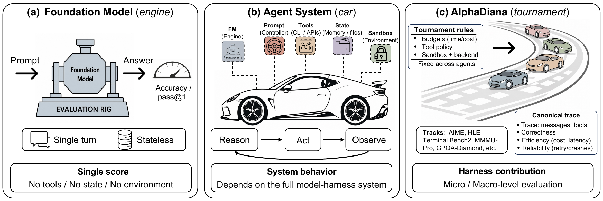

# AlphaDiana: A System for Evaluating Agentic Reasoning

**AlphaDiana** is an open-source framework for **system-level evaluation of LLM-based reasoning agents**. It enables standardized, reproducible benchmarking of agentic systems—such as **[OpenClaw](https://github.com/openclaw/openclaw)**—on frontier reasoning tasks, with support for sandboxed code execution, multi-turn tool use, and full trajectory logging.

<p align="center">
  
</p>
<p align="center">
  <em><strong>Figure 1.</strong> Why agentic reasoning requires system-level evaluation: foundation models are evaluated like engines, agents behave like cars shaped by tools and state, and AlphaDiana serves as the tournament organizer that standardizes evaluation and records canonical traces.</em>
</p>

## Why AlphaDiana?

Reasoning performance in agent systems depends on more than the base model alone. It is also shaped by the **agent framework, tool interface, execution environment, and evaluation protocol**.

AlphaDiana is designed for **fair, reproducible, and transparent** evaluation of agentic reasoning systems.

With AlphaDiana, you can:
- evaluate **OpenClaw-style reasoning agents**
- compare against a **direct LLM baseline**
- run evaluations with **sandboxed execution**
- benchmark on **AIME 2026, GPQA-Diamond, HLE, IMO-AnswerBench, MMMU-Pro,
  SWE-bench Verified, Terminal-Bench 2, and custom tasks**
- record and inspect **full execution traces**
- launch and compare runs through both **CLI and dashboard**

Typical questions AlphaDiana helps answer:
- How much does an agent improve over the base model?
- How well does it perform on a target benchmark?
- How much do tools and sandbox settings affect results?
- What failure modes appear in execution traces?

## Key Features

- **Standardized evaluation** for reproducible benchmarking of agentic reasoning systems  
- **OpenClaw support** for multi-turn reasoning with tool use and code execution  
- **ROCK sandbox integration** for safe, isolated execution  
- **Direct LLM baseline** for clean agent-vs-model comparison  
- **Built-in benchmarks** covering AIME 2026, GPQA-Diamond, HLE,
  IMO-AnswerBench, MMMU-Pro, SWE-bench Verified, Terminal-Bench 2, and custom tasks
- **Full trace logging** for debugging, inspection, and analysis  
- **Web dashboard** for launching, monitoring, and comparing runs  
- **Automatic sandbox management** with configurable concurrency

## Quick Start

### Prerequisites

- Linux
- Python >= 3.10, Conda
- Docker (the current user should be in the `docker` group)
- An API key for a model provider (e.g., [OpenRouter](https://openrouter.ai/))

### 1. Install

```bash
git clone https://github.com/tmlr-group/AlphaDiana
cd AlphaDiana

# One-click core setup: creates a checkout-local conda env, installs runtime
# and benchmark dependencies, and starts ROCK services
export OPENCLAW_GATEWAY_TOKEN="$(openssl rand -hex 32)"
bash scripts/quickstart.sh

# Note: If quickstart fails, or you want to reset the ports/RAY clusters, please run: bash scripts/cleanup_rock_ports.sh (USE WITH CAUTION!)

# Pull the reasoning image (OpenClaw pre-installed)
docker pull tmlrgroup/alphadiana:v1
```

### 2. Configure your model

Create a `.env` file in the project root with your model endpoint and set your api key:

```bash
touch .env
echo "OPENAI_BASE_URL=https://openrouter.ai/api/v1" >> .env
echo "OPENAI_API_KEY=<your-api-key>" >> .env
echo "OPENAI_MODEL_NAME=Qwen/Qwen3.5-27B" >> .env
```

### 3. Activate the environment

Run this **once per terminal** before using AlphaDiana. It handles conda activation, proxy cleanup, port loading, and API key loading automatically:

```bash
source scripts/activate.sh
```

### 4. Check optional ROCK services

```bash
alphadiana env
```

If you ran the full quickstart and plan to use ROCK, all four checks should pass:

```
  ✓ admin
  ✓ proxy
  ✓ redis
  ✓ docker
```

### 5. Run your first evaluation

```bash
alphadiana validate configs/macro_runs/aime2026_directllm_qwen35_27b.yaml \
  -o benchmark.config.max_tasks=1
alphadiana run configs/macro_runs/aime2026_directllm_qwen35_27b.yaml \
  -o run_id=quickstart_aime_directllm_t1_k1 \
  -o benchmark.config.max_tasks=1 \
  -o num_samples=1
```

This DirectLLM path does not require ROCK. A successful provider call writes one
scored task record; the accuracy depends on the model response and is not fixed.

### 6. Print a report

```bash
alphadiana report results/
```

`alphadiana report` prints Markdown to standard output. Redirect it when you
want a file, for example: `alphadiana report results/ > report.md`.

For a full walkthrough, see [Getting Started](docs/getting-started/quick-start.md).
For the documentation entry point, see [Welcome to AlphaDiana](docs/README.md).
For Podman-backed paths, start from the matching page under [Benchmarks](docs/benchmarks/README.md).
For manual setup and recovery, see [Installation](docs/getting-started/installation.md)
and [Troubleshooting](docs/getting-started/troubleshooting.md).
For ZeroClaw, see the [harness guide](docs/harnesses/zeroclaw.md) and
[AIME benchmark page](docs/benchmarks/aime.md).

## Configuration

AlphaDiana is configured with a YAML file. At a high level, you specify:

- the **agent**
- the **benchmark**
- the **scorer**
- the **runtime settings** such as concurrency and output directory

Ready-to-run macro and micro experiments are indexed in
[`configs/README.md`](configs/README.md).

## CLI Reference

| Command | Description |
|---|---|
| `alphadiana env` | Check service health before running |
| `alphadiana run <config.yaml>` | Run an evaluation |
| `alphadiana validate <config.yaml>` | Validate a config without running |
| `alphadiana report <results_dir>` | Print Markdown reports from saved result JSONL files |
| `alphadiana batch <config1> <config2> ...` | Run multiple experiments |
| `alphadiana list-benchmarks` | List the complete benchmark registry used by the Runner |

Use `-o key=value` to override config values from the command line (e.g., `-o max_concurrent=4`).

## Results and analysis

AlphaDiana treats a score as a property of the model, harness, task, scorer,
environment, and budget together. The [Results](docs/results.md) document presents
selected draft tables and process-analysis figures; reports from saved results
can be regenerated with `alphadiana report <results_dir>`.

When reviewing a result, start from `score_status`, scorer identity, expected
sample count, and the recorded `isolation_mode`. Report Pass@k and Avg@k with
the configured `num_samples`; do not compare rows whose runtime or evaluation
contracts differ.

## Dashboard

AlphaDiana includes a web dashboard for launching, monitoring, and comparing evaluation runs without manually editing YAML or inspecting raw JSONL files.

Dashboard dependencies are optional and are not installed by `quickstart.sh`:

```bash
pip install -e '.[dashboard]'
cd alphadiana/analysis/dashboard/frontend && npm install
```

<p align="center">
  
  
</p>

### Dashboard features

- browse run history
- compare multiple runs side by side
- launch evaluations through forms
- monitor job progress with real-time logs
- manage ROCK sandboxes

## Documentation

| Document | Description |
|---|---|
| [Welcome](docs/README.md) | Documentation entry point and concept map |
| [Getting Started](docs/getting-started/README.md) | Installation, first run, and troubleshooting |
| [Architecture](docs/architecture/README.md) | Runner, registries, sandboxes, scoring, and observability |
| [Harnesses](docs/harnesses/README.md) | DirectLLM, OpenClaw, OpenCode, and ZeroClaw behavior |
| [Benchmarks](docs/benchmarks/README.md) | Supported benchmark loaders and runbooks |
| [Configuration](docs/configuration/README.md) | YAML schema and CLI override semantics |
| [Results](docs/results.md) | Selected draft tables and process-analysis figures |
| [Dashboard](docs/dashboard.md) | Launch, monitor, browse, and compare runs locally |

## Acknowledgements

AlphaDiana is developed to support research on trustworthy agentic reasoning and reproducible evaluation of reasoning systems. We thank the contributors, collaborators, and open-source communities behind tools and systems that make this work possible, including [OpenClaw](https://github.com/openclaw/openclaw), [ROCK](https://github.com/alibaba/ROCK), and related infrastructure.

## Citation

If you use AlphaDiana in your research, please cite either of the following papers:

```bibtex
@inproceedings{
zhou2026reasoning,
title={Reasoning Is More Than the Model: Harness-Aware Evaluation of Agents on Verifiable Reasoning Tasks},
author={Zhanke Zhou and Zongze Li and Weikai Huang and Xuan Li and Chentao Cao and Xiao Feng and Xiangyu Lu and Jinbo Hu and Menghan Lu and Yi Xie and Nico Pelleriti and Shiyang Liu and Max Zimmer and Brando Miranda and Jiangchao Yao and Bo Liu and Sanmi Koyejo and Sebastian Pokutta and Bo Han},
booktitle={3rd AI for Math Workshop: Toward Self-Evolving Scientific Agents},
year={2026},
url={https://openreview.net/forum?id=4vARlk9o95}
}

@inproceedings{
zhou2026reasoning,
title={Reasoning Is More Than the Model: Harness-Aware Evaluation of Agents on Verifiable Reasoning Tasks},
author={Zhanke Zhou and Zongze Li and Weikai Huang and Xuan Li and Chentao Cao and Xiao Feng and Xiangyu Lu and Jinbo Hu and Menghan Lu and Yi Xie and Nico Pelleriti and Shiyang Liu and Max Zimmer and Brando Miranda and Jiangchao Yao and Bo Liu and Sanmi Koyejo and Sebastian Pokutta and Bo Han},
booktitle={ICML 2026 Workshop: AI as a Tool for Mathematics, Computer Science, and Machine Learning},
year={2026},
url={https://openreview.net/forum?id=fnHhEf0cSE}
}
```
