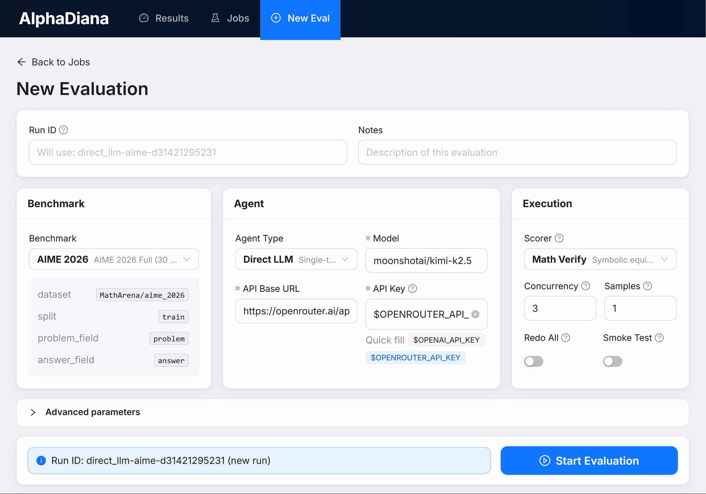
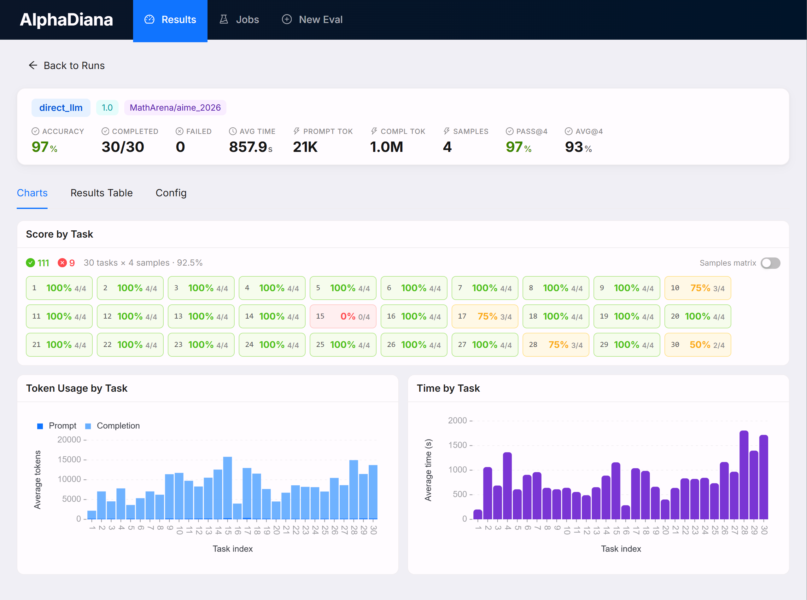

# Dashboard

AlphaDiana includes a local React and FastAPI application for launching and
monitoring evaluations without editing YAML by hand. It can browse saved runs,
inspect task trajectories, compare runs, follow job logs, and manage supported
ROCK sandbox workflows.

The dashboard is a local operations interface, not the repository documentation
or the runner's `status/dashboard.txt` terminal-status artifact.

| Create an evaluation | Inspect results |
|---|---|
|  |  |

## Install

From the repository root, activate the AlphaDiana environment and install the
dashboard dependencies:

```bash
source scripts/activate.sh
pip install -e '.[dashboard]'

cd alphadiana/analysis/dashboard/frontend
npm install
cd ../../../..
```

Development mode starts Vite and FastAPI separately and reloads source changes.
Production mode builds the frontend before serving it from FastAPI.

## Start

```bash
cd alphadiana/analysis/dashboard
./run.sh
```

The launcher prints the selected URLs. It prefers ports `5173` (frontend) and
`8000` (backend), then chooses the next available local port if either is busy.

To build and serve the frontend and API together:

```bash
cd alphadiana/analysis/dashboard
./run.sh --prod
```

Both modes bind the backend to `127.0.0.1`. The application has no authentication
layer, so do not expose it on a public interface or through an unauthenticated
reverse proxy.

## Data and runtime configuration

By default, the launcher reads and writes the checkout's `results/` and
`configs/` directories. Override those locations before launch when needed:

```bash
export ALPHADIANA_RESULTS_DIR=./results
export ALPHADIANA_CONFIGS_DIR=./configs
```

The run list is rebuilt from saved result JSONL files. Job metadata and logs are
persisted under the results directory. After a backend restart, job history is
restored and formerly active jobs are marked `interrupted`; their old worker
processes do not resume automatically. Use the Jobs page's resume flow to continue
from the saved checkpoint.

The launcher loads checkout-local ROCK port settings when available. Sandbox
deployment controls additionally require the ROCK SDK and healthy checkout-owned
ROCK services; browsing DirectLLM results does not.

## Pages

- **Runs** lists saved evaluations and opens task-level details and trajectories.
- **Compare** aligns selected runs for side-by-side inspection.
- **Jobs** shows evaluations submitted through the dashboard, progress, and logs.
- **New Evaluation** creates DirectLLM or supported OpenClaw jobs from a form.
- **Sandbox controls** list, probe, and deploy supported ROCK sandboxes.

For result formats, lifecycle events, and logprob capture, see
[Observability & Proxies](./architecture/observability.md). For provider and ROCK
setup, start with [Installation](./getting-started/installation.md).
