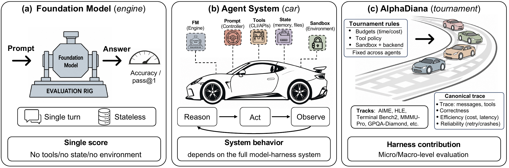
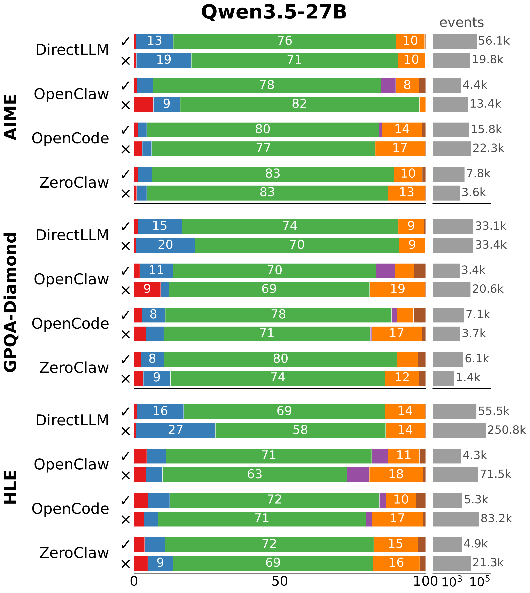
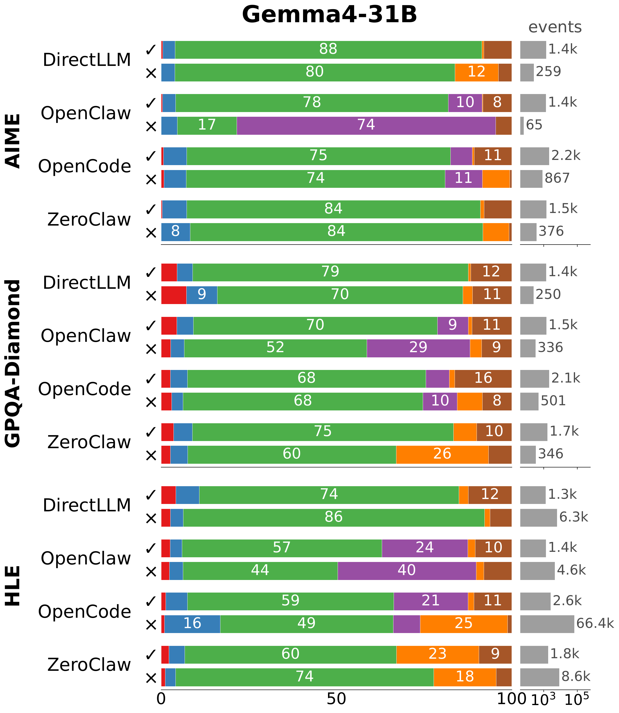
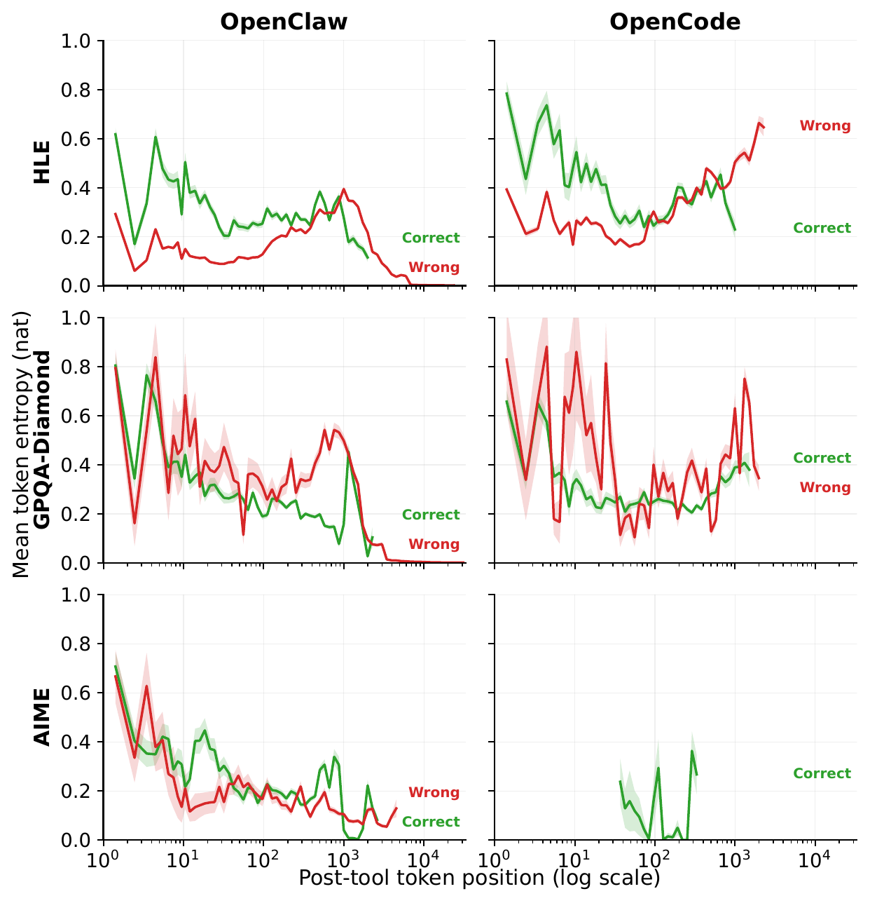
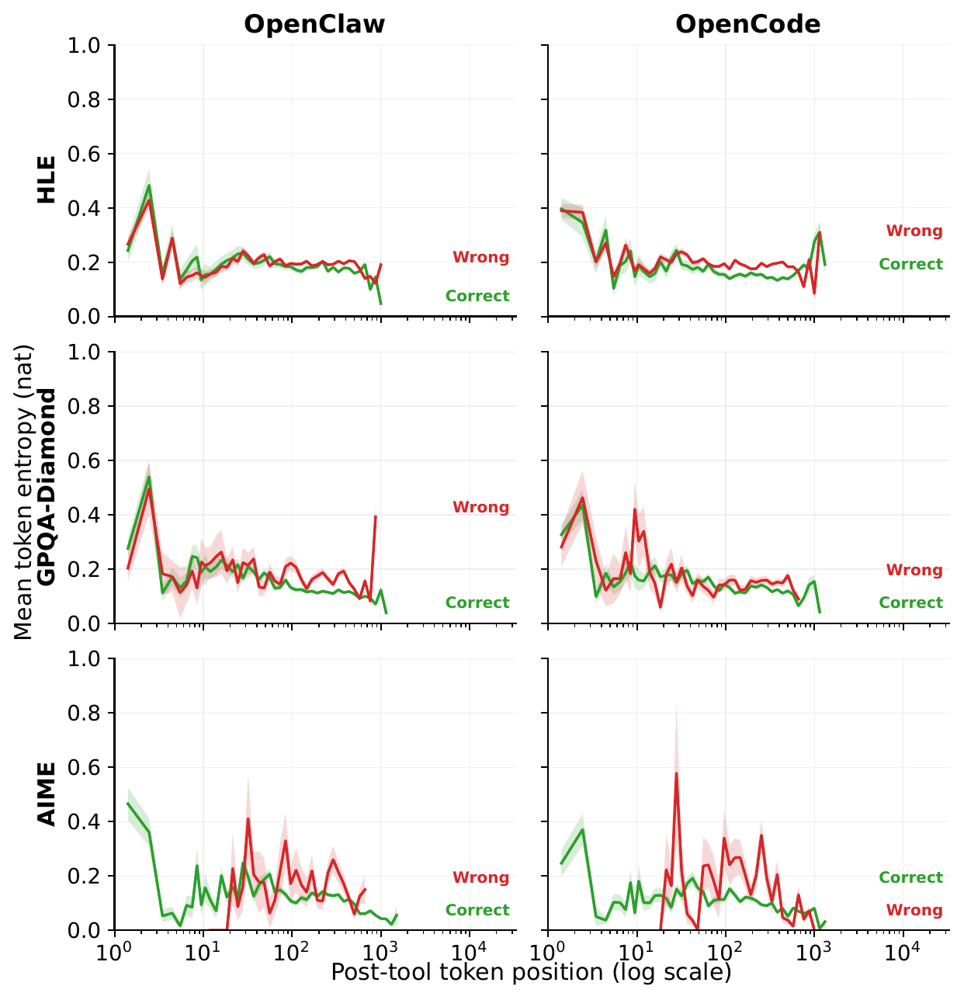
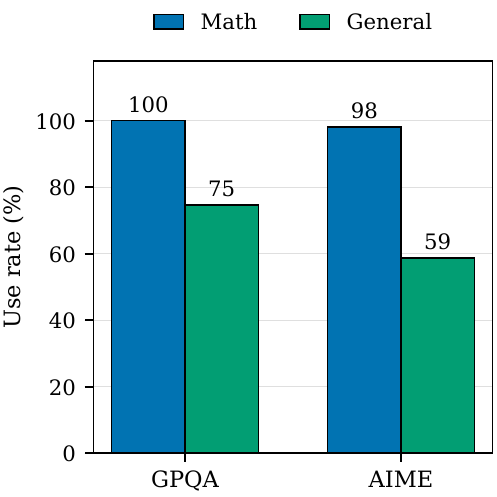
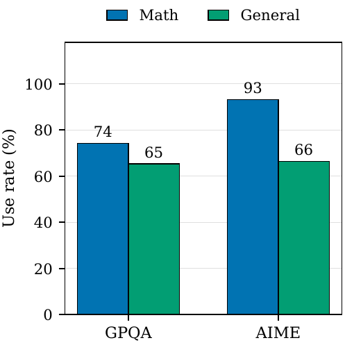
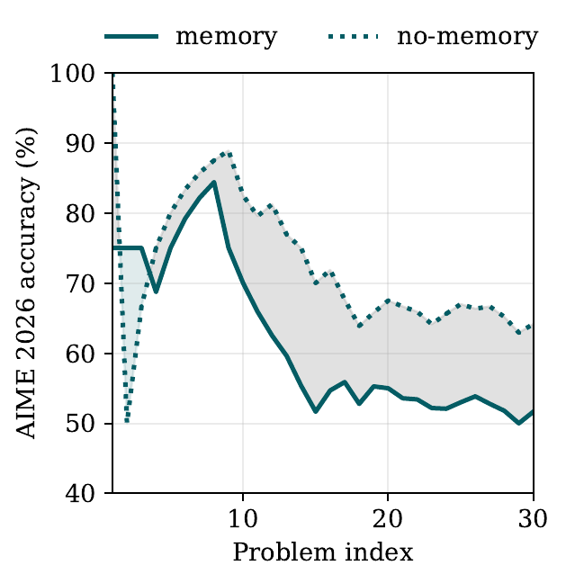
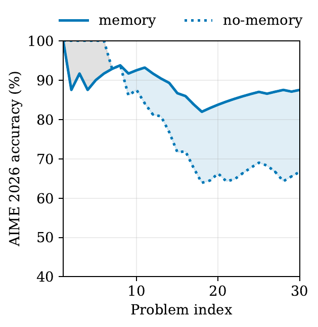
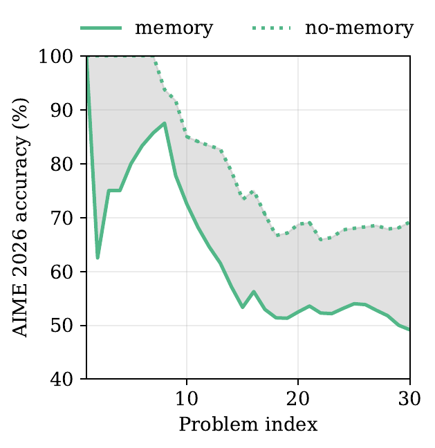

# Results and Process Analysis

AlphaDiana evaluates a model together with its harness, task, scorer,
environment, and budget. The selected values below come from the draft
manuscript and illustrate why harness effects must be reported per
model–harness–task combination.

> [!CAUTION]
> These tables and figures are manuscript summaries, not standalone support
> evidence. Cite exact values only together with the corresponding archived
> task records, raw logs, and evaluation contract.

## Selected macro results

Values are percentages. AIME 2026 reports Pass@4 and Avg@4; the other columns
report Avg@1.

### Qwen3.5-27B

| Harness | IMO | HLE | GPQA | AIME Pass@4 | AIME Avg@4 | MMMU-Pro |
|---|---:|---:|---:|---:|---:|---:|
| Direct | 58.3 | 23.0 | 81.3 | 96.7 | 89.2 | 73.4 |
| OpenClaw | 20.3 | 13.4 | 66.2 | 83.3 | 64.2 | 68.3 |
| ZeroClaw | 17.5 | 15.0 | 77.8 | 86.7 | 66.7 | 67.2 |
| OpenCode | 15.8 | 13.9 | 73.2 | 86.7 | 69.2 | 69.4 |

### Gemma-4-31B-IT

| Harness | IMO | HLE | GPQA | AIME Pass@4 | AIME Avg@4 | MMMU-Pro |
|---|---:|---:|---:|---:|---:|---:|
| Direct | 59.0 | 27.9 | 83.3 | 96.7 | 92.5 | 65.8 |
| OpenClaw | 59.5 | 24.2 | 85.4 | 100.0 | 97.5 | 56.8 |
| ZeroClaw | 61.5 | 29.1 | 86.4 | 100.0 | 96.7 | 66.4 |
| OpenCode | 62.5 | 24.0 | 87.9 | 100.0 | 96.7 | 67.4 |

### Kimi-K2.6

| Harness | IMO | HLE | GPQA | AIME Pass@4 | AIME Avg@4 | MMMU-Pro |
|---|---:|---:|---:|---:|---:|---:|
| Direct | 42.0 | 35.9 | 77.8 | 96.7 | 85.8 | 75.1 |
| OpenClaw | 27.3 | 40.7 | 31.8 | 93.3 | 72.5 | 48.6 |
| ZeroClaw | 38.7 | 33.7 | 87.4 | 100.0 | 93.3 | 64.7 |
| OpenCode | 48.5 | 33.9 | 80.8 | 100.0 | 86.7 | 71.3 |

The selected cells contain both gains and losses. Direct inference is the
reference condition only when the model, task, scorer, and shared budget are
matched and harness-specific runtime conditions are disclosed.

## Process-analysis figures

| Qwen3.5 | Gemma |
|---|---|
|  |  |
|  |  |

These figures summarize outcome-conditioned action composition and post-tool
entropy from the draft analysis. They show why final scores alone do not explain
how a harness changed model behavior.

## Micro-study figures

The paper micro study is the matched Tool and Skill matrix over ZeroClaw and
OpenCode, Qwen3.5-27B and Kimi-K2.6, and GPQA-Diamond and AIME 2026. Runnable
conditions are indexed under `configs/micro_runs/Tool/` and `Skill/`.

### Skill

| ZeroClaw | OpenCode |
|---|---|
|  |  |

### Cross-task memory extension

The following plots come from a separate Memory follow-up. They are not part of
the current paper's Tool/Skill micro tables.

| OpenClaw | OpenCode | ZeroClaw |
|---|---|---|
|  |  |  |

Tool, Skill, and Memory conditions can change both prompts and runtime behavior.
Their deltas should therefore be interpreted as intervention bundles rather
than isolated causal effects; Memory should additionally be labeled as a
non-paper extension.
